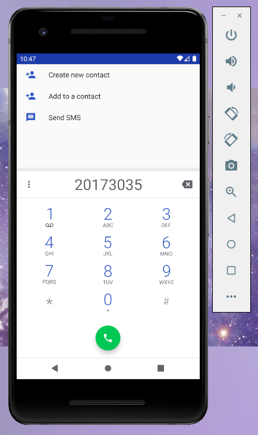
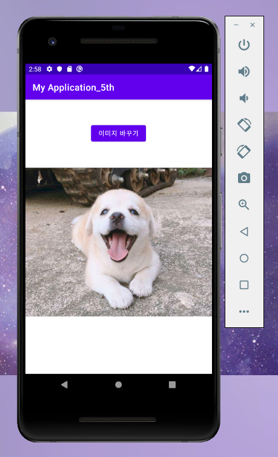
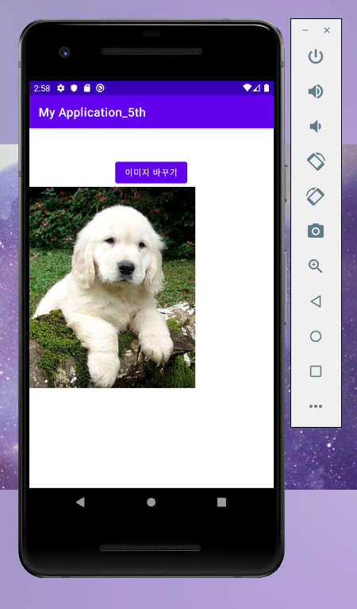
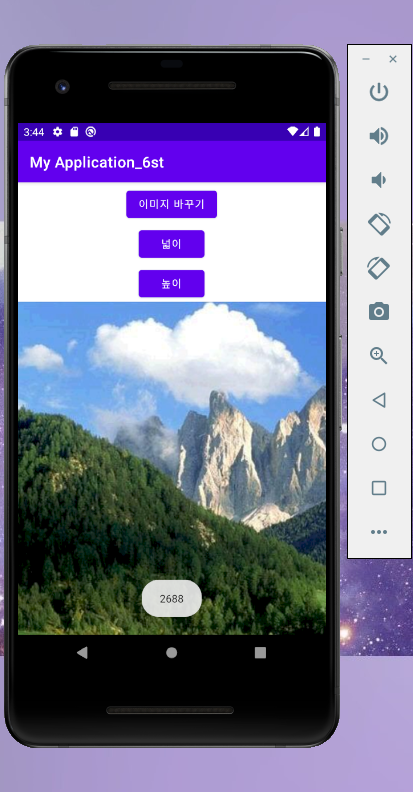
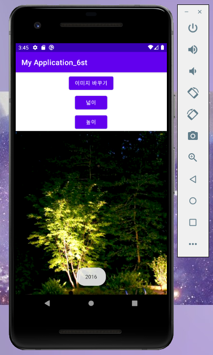
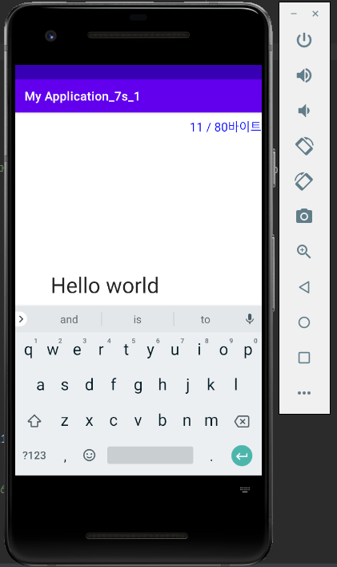
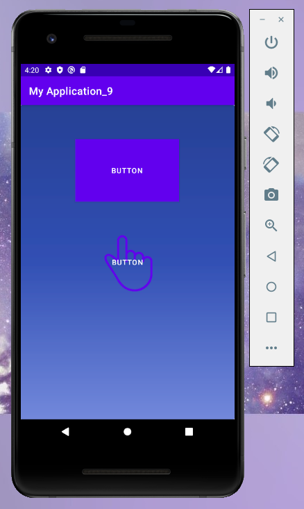
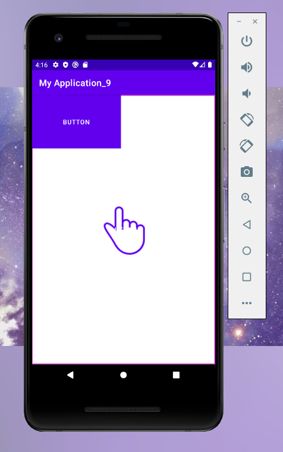
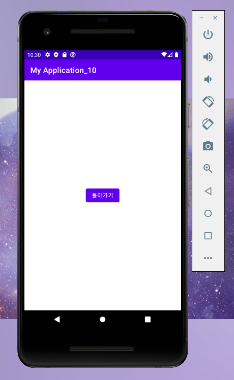
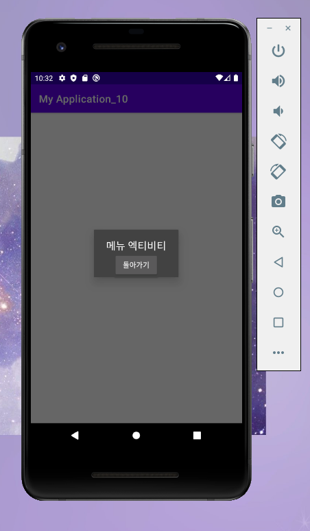

# 20173035 배한솔

## 1주차 과제

## 2주차 과제

## 3주차 과제

</img>

</img>

## 4주차 과제
<체형에 맞는 옷을 구입할 수 있게 해주는 앱>

스마트폰으로 사진을 찍은 다음에 체형에 맞는 의상 및 쇼핑몰을 추천해주는 앱

자신에게 어울리는 옷을 구입할 수 있고 온라인으로 편리하게 쇼핑할 수 있을 것입니다.

## 5주차 과제

</img>

</img>

## 6주차 과제

</img>

</img>

## 7주차 과제

</img>

## 9주차 과제

</img>

</img>

## 10주차 과제

</img>

</img>

